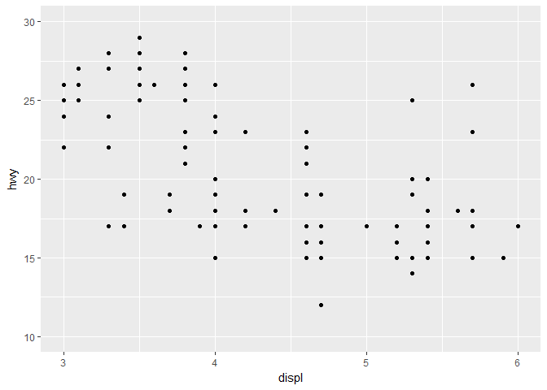
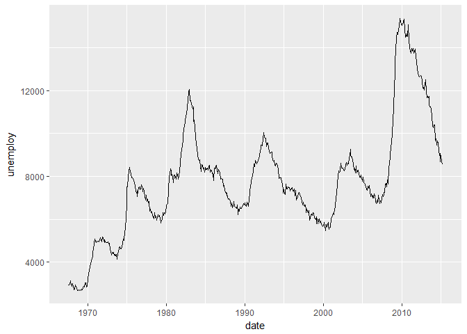
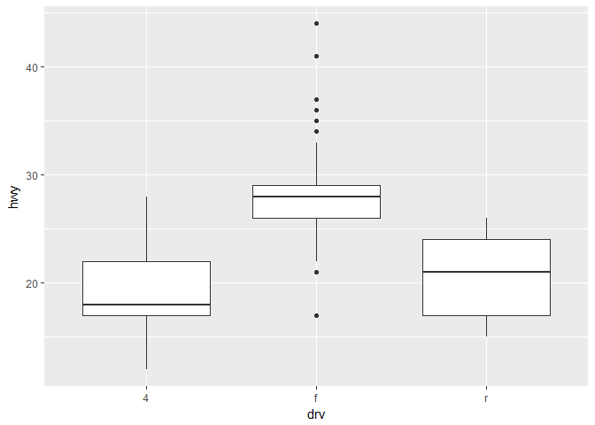

chap8. 그래프 만들기
================

### 준비 환경

``` r
library(ggplot2)
library(dplyr)
mpg <- ggplot2::mpg
```

1. 산점도
---------

``` r
ggplot(data = mpg, aes(x = displ, y = hwy)) +
  geom_point()
```


### 축 설정 추가

``` r
ggplot(data = mpg, aes(x = displ, y = hwy)) +
    geom_point() +
    xlim(3, 6) +
    ylim(10, 30)
```

    ## Warning: Removed 105 rows containing missing values (geom_point).



2. 평균 막대 그래프
-------------------

### 평균표 만들기

``` r
df_mpg <- mpg %>%
    group_by(drv) %>%
    summarise(mean_hwy = mean(hwy))
```

### 그래프 생성하기, 크기순 정렬하기

``` r
ggplot(data = df_mpg, aes(x = reorder(drv, -mean_hwy), y = mean_hwy)) + 
    geom_col()
```


3. 빈도 막대 그래프
-------------------

``` r
ggplot(data = mpg, aes(x = drv)) +
    geom_bar()
```


4. 선 그래프
------------

``` r
ggplot(data = economics, aes(x = date, y = unemploy)) +
    geom_line()
```



5. 상자 그림
------------

``` r
ggplot(data = mpg, aes(x = drv, y = hwy)) +
  geom_boxplot()
```


